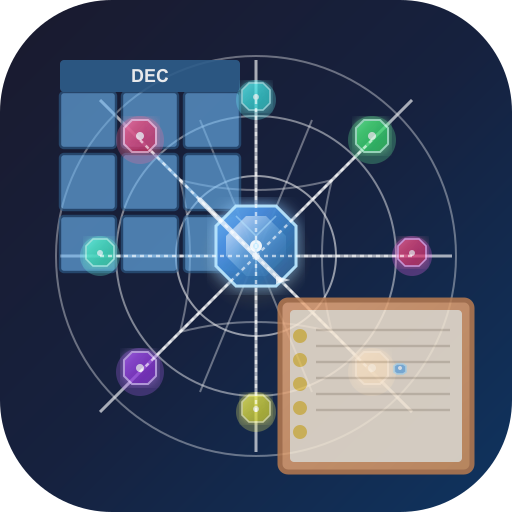

<p align="center">
  
</p>

# CalenRecall

A self-contained calendar journal application for Windows that helps you recall memories across decades, years, months, weeks, and days. All your journaling history is stored locally on your device.

## Features

### Core Functionality

- **Multiple Time Views**: Navigate through decades, years, months, weeks, or days with intuitive calendar grids
- **Hierarchical Entry System**: 
  - Day entries appear in calendar day cells
  - Week entries shown in month view's side panel, grouped by week
  - Month entries displayed in year view's month cells
  - Year entries displayed in decade view's year cells
  - Decade entries for long-term memories
  - All period entries (week/month/year/decade) listed in the right panel for easy access
- **Time-Specific Entries**: Create entries with specific hours, minutes, and seconds for precise time tracking
- **Entry Management**: 
  - Create, edit, and delete entries at any time scale
  - Link related entries together
  - Archive and pin/favorite entries
  - Attach files to entries
  - Entry versioning and history
- **Global Timeline Minimap**: Interactive visual overview of your entire timeline featuring:
  - Drag-to-navigate through time periods
  - Visual indicators for entries at different time scales
  - Smooth zooming between time scales (decade → year → month → week → day)
  - Color-coded time scale indicators
  - Entry clustering for dense time periods
  - Real-time position updates as you navigate
  - Customizable size (small, medium, large)
  - Toggle visibility on/off
- **Search & Recall**: 
  - Full-text search across all entries
  - Search by tags, dates, or content
  - Quick navigation to found entries
- **Rich Text Editing**: 
  - Markdown support in entry content
  - Tags for organizing entries
  - Custom entry colors
- **Export & Import**: 
  - Export entries in multiple formats: Markdown, Text, JSON, RTF, PDF, DEC, CSV
  - Profile-based export selection for all formats
  - Password-protected profile export support
  - Comprehensive export metadata (author, organization, copyright, etc.)
  - Import entries from JSON or Markdown files
  - Import progress tracking
- **Preferences System**: Comprehensive settings including:
  - Default view mode, date format, week start day
  - Theme selection (light/dark/auto + 34 custom themes)
  - Font size customization
  - Timeline minimap visibility and size
  - Calendar system selection
  - Auto-save settings
  - Sound effects toggle
  - Window size and position (automatically saved)
  - Restore last viewed position
- **Multi-Profile Support**: Create multiple isolated profiles for different purposes (personal, work, health, etc.)
- **Profile Password Protection**: Secure your profiles with passwords and recovery keys
- **Local Storage**: All data is stored locally using SQLite - your privacy is protected
- **Visual Indicators**: See which dates have entries at a glance with color-coded badges
- **Self-Contained**: Distribute as a single Windows installer or portable executable

### Calendar Systems

CalenRecall supports **17 different calendar systems** for viewing and entering dates:

1. **Gregorian** - The most widely used civil calendar (default)
2. **Julian** - Ancient Roman calendar, still used by some Orthodox churches
3. **Islamic (Hijri)** - Lunar calendar used by Muslims worldwide
4. **Hebrew** - Lunisolar calendar used for Jewish religious observances
5. **Persian (Jalali)** - Solar calendar used in Iran and Afghanistan
6. **Chinese (农历)** - Traditional lunisolar calendar with 24 solar terms
7. **Ethiopian** - 13-month calendar used in Ethiopia and Eritrea
8. **Coptic** - Calendar used by the Coptic Orthodox Church
9. **Indian Saka** - Official civil calendar of India
10. **Baháʼí** - Calendar used by followers of the Baháʼí Faith
11. **Thai Buddhist** - Buddhist era calendar used in Thailand
12. **Mayan Tzolk'in** - 260-day sacred calendar cycle
13. **Mayan Haab'** - 365-day solar calendar
14. **Mayan Long Count** - Linear calendar counting days from creation
15. **Cherokee** - 12-month calendar with traditional Cherokee month names
16. **Iroquois** - 13-moon calendar based on lunar cycles
17. **Aztec Xiuhpohualli** - 365-day solar calendar with 18 months

Each calendar system includes:
- Accurate date conversion
- Historical context and descriptions
- Cultural and religious significance information
- Support for negative years and ancient dates
- Proper handling of leap years and intercalary periods

### Themes

CalenRecall includes **37 built-in themes** to customize your journaling experience:

**Standard Themes:**
- Light / Dark / Auto (system preference)
- Classic Light / Classic Dark (Windows 95 aesthetic)
- High Contrast (accessibility)
- Terminal (monochrome)
- BIOS (DOS-like aesthetic)

**Nature Themes:**
- Forest (green nature theme)
- Ocean (cool blue)
- Sunset (warm orange)
- Red Rock (Grand Canyon inspired)
- Australian Desert (warm desert tones)
- Hot Spring (steamy blues and purples)

**Retro Themes:**
- NEON (1980s retro)
- Vegas 80s (neon nightlife)

**Modern Themes:**
- Modern Minimal
- Modern Minimal OLED (true black for OLED displays)
- Aero (Windows Aero glassmorphism)

**Academic Themes:**
- Scholar (medieval manuscripts)
- Archive (19th-century libraries)
- Librarian's Study (modern academic library)
- Research (historical archive)
- Manuscript Room (rare book room)
- Reading Room (traditional library)

**Gaming/Sci-Fi Themes:**
- ON SCREEN (LCARS-inspired)
- Elite (Dangerous)
- Journeyman (The Journeyman Project inspired)
- Temple of Light / Temple of Darkness (sacred aesthetic)
- Kallisti (Eris-ish)
- Galactic Basic (war stars)
- Stellar Echo (cosmo beans)
- Out There (trust no one)
- The Real World (has you)
- Football (sports)

**Special Themes:**
- Tabletop (board game aesthetic)

**Custom Themes:**
- Create your own themes using the theme template
- Themes stored in AppData for easy customization
- Automatic theme discovery

### Keyboard Shortcuts

- `Ctrl+N` or `Cmd+N` - Create new entry
- `Shift+Spacebar` - Create new entry (when search is closed)
- `Ctrl+F` or `Cmd+F` - Open search
- `Escape` - Close search or modals

## Development

### Prerequisites

- **Node.js** (v18 or higher)
- **npm** or **yarn**
- **Python** (for building native modules like better-sqlite3 on Windows)
- **Visual Studio Build Tools** (for Windows native module compilation)

### Setup

1. **Install dependencies:**
```bash
npm install
```

**Note**: On Windows, you may need to install build tools for native modules:
- Install [Windows Build Tools](https://github.com/felixrieseberg/windows-build-tools) or
- Install [Visual Studio Build Tools](https://visualstudio.microsoft.com/downloads/#build-tools-for-visual-studio-2022)

2. **Run in development mode:**
```bash
npm run dev
```

This will:
- Rebuild native modules (better-sqlite3)
- Compile Electron TypeScript files
- Start the Vite dev server (on port 5173)
- Watch for Electron file changes
- Launch Electron automatically

### Building

**Build the application for production:**
```bash
npm run build
```

This compiles both the React frontend and Electron backend.

**Note**: The build process includes automatic cleanup of previous release files and will open the release folder when complete.

**Create a Windows distribution:**

**Option 1: Installer (NSIS) - Recommended for distribution**
```bash
npm run dist:win:installer
```
This creates an installer (.exe) that users can run to install the application.

**Option 2: Portable executable (standalone .exe)**
```bash
npm run dist:win:portable
```
This creates a portable `.exe` file that can be run directly without installation.

**Option 3: Both installer and portable**
```bash
npm run dist:win
```

**Option 4: Packaged build (both formats with cleanup)**
```bash
npm run dist:win:pack
```

**Using Batch Files (Windows):**

For convenience, you can also use the provided batch files:

- `build-release.bat` - Builds portable .exe only
- `build-installer.bat` - Builds installer .exe only  
- `build-all.bat` - Builds both installer and portable

Simply double-click the batch file or run it from the command line. The batch files will:
1. Check and install dependencies if needed
2. Build the application
3. Create the distribution files
4. Open the `release` folder when complete

All builds are created in the `release` directory, and the folder will automatically open in Windows Explorer when the build completes. The applications are self-contained and don't require any additional dependencies.

### Version Management

CalenRecall uses **automatic date-based versioning** that increments with each build. Versions follow the format:

**`YYYY.MM.DD.BUILD`**

For example: `2024.01.15.3` means the 3rd build on January 15, 2024.

#### How It Works

- **Automatic**: Version is automatically incremented before each build
- **Date-based**: Each version includes the build date (YYYY.MM.DD)
- **Build counter**: If multiple builds happen on the same day, the build number increments (1, 2, 3, ...)
- **New day reset**: When a new day starts, the build number resets to 1

#### Viewing Current Version

```bash
npm run version:show    # Display current version
```

#### Manual Version Bump (if needed)

If you need to manually trigger a version bump without building:

```bash
npm run version:auto    # Manually trigger automatic version increment
```

#### Release Workflow

The version is **automatically incremented** when you build. Simply:

1. **Build your release** (version increments automatically):
   ```bash
   npm run dist:win:pack  # or use build-all.bat
   ```

2. **Update CHANGELOG.md** with the changes for the new version (optional but recommended)

3. **Commit the changes:**
   ```bash
   git add package.json CHANGELOG.md
   git commit -m "Build version YYYY.MM.DD.BUILD"
   ```

4. **Create a git tag** (optional):
   ```bash
   git tag -a vYYYY.MM.DD.BUILD -m "Version YYYY.MM.DD.BUILD"
   git push origin main --tags
   ```

The version in `package.json` is automatically used by electron-builder for the build artifacts. Build information is stored in `.build-info.json` (not tracked in git) to ensure consistent version incrementing.

### Testing

CalenRecall includes test scripts for verifying calendar accuracy:

```bash
npm run test:calendars    # Test calendar conversion accuracy
npm run test:epochs      # Verify epoch calculations
npm run test:chinese     # Verify Chinese calendar accuracy
```

### Project Structure

```
CalenRecall/
├── electron/              # Electron main process
│   ├── main.ts            # Main entry point and window management
│   ├── preload.ts         # Preload script (IPC bridge)
│   ├── database.ts        # SQLite database operations and preferences
│   ├── ipc-handlers.ts   # IPC message handlers
│   └── types.ts           # Shared TypeScript types
├── src/                   # React frontend
│   ├── components/       # React components
│   │   ├── TimelineView.tsx           # Calendar grid views
│   │   ├── CalendarView.tsx           # Calendar rendering
│   │   ├── EntryViewer.tsx            # Right panel entry display
│   │   ├── JournalEditor.tsx          # Entry editing interface
│   │   ├── GlobalTimelineMinimap.tsx  # Top timeline overview
│   │   ├── NavigationBar.tsx          # Date navigation and view controls
│   │   ├── Preferences.tsx            # Preferences window
│   │   ├── SearchView.tsx             # Search interface
│   │   ├── LoadingScreen.tsx          # Loading screen with progress
│   │   └── ...                        # Other components
│   ├── contexts/         # React contexts
│   │   ├── CalendarContext.tsx       # Calendar system state
│   │   └── EntriesContext.tsx         # Journal entries state
│   ├── services/         # API service layer
│   │   └── journalService.ts          # Entry retrieval logic
│   ├── utils/            # Utility functions
│   │   ├── dateUtils.ts               # Date formatting and manipulation
│   │   ├── calendars/                 # Calendar system implementations
│   │   │   ├── calendarConverter.ts   # Calendar conversion utilities
│   │   │   ├── calendarDescriptions.ts # Calendar descriptions
│   │   │   ├── julianDayUtils.ts      # Julian Day Number calculations
│   │   │   ├── gregorian.ts           # Gregorian calendar
│   │   │   ├── julian.ts              # Julian calendar
│   │   │   ├── islamic.ts             # Islamic calendar
│   │   │   ├── hebrew.ts              # Hebrew calendar
│   │   │   ├── persian.ts             # Persian calendar
│   │   │   ├── chinese.ts             # Chinese calendar
│   │   │   └── ...                    # Other calendar systems
│   │   ├── themes.ts                  # Theme management
│   │   ├── audioUtils.ts              # Sound effects
│   │   └── ...                        # Other utilities
│   ├── themes/           # Theme CSS files
│   │   ├── light.css                  # Light theme
│   │   ├── dark.css                   # Dark theme
│   │   ├── theme-template.css         # Theme creation template
│   │   └── ...                        # 30+ custom themes
│   └── types.ts          # TypeScript type definitions
├── scripts/              # Build and utility scripts
│   ├── auto-version.js   # Automatic version incrementing
│   ├── clean-release.js  # Clean release directory
│   └── ...              # Other build scripts
├── assets/               # Application assets (icons, etc.)
├── dist/                # Built React frontend
├── dist-electron/       # Built Electron backend
├── release/             # Distribution builds
└── _MD BIN/             # Documentation and research files
```

## Technology Stack

- **Electron** - Desktop application framework
- **React** - UI library
- **TypeScript** - Type safety
- **Vite** - Build tool and dev server
- **better-sqlite3** - Local database storage
- **date-fns** - Date manipulation utilities
- **PDFKit** - PDF generation for exports

## Data Storage

All journal entries and preferences are stored in a SQLite database located in the application's user data directory:
- **Windows**: `%APPDATA%\calenrecall\calenrecall.db` (typically `C:\Users\<username>\AppData\Roaming\calenrecall\`)
- **macOS**: `~/Library/Application Support/calenrecall/calenrecall.db`
- **Linux**: `~/.config/calenrecall/calenrecall.db`

The database includes:
- **journal_entries**: All your journal entries with support for:
  - Multiple time scales (decade, year, month, week, day)
  - Time-specific entries (hour, minute, second)
  - Tags, linked entries, attachments
  - Archiving and pinning
  - Entry versioning
- **preferences**: Application settings and user preferences
- **entry_versions**: Historical versions of edited entries
- **entry_templates**: Reusable entry templates

Your data never leaves your device. Simply copy the database file to backup your entire journal history.

## Usage

### Creating Entries

You can create journal entries at different time scales:
- **Day entries**: Specific to a single day (can include specific time)
- **Week entries**: Apply to an entire week (Monday-Sunday)
- **Month entries**: Apply to all days in a month
- **Year entries**: Apply to all days in a year
- **Decade entries**: Apply to all years in a decade

**Keyboard shortcuts:**
- Press `Ctrl+N` (or `Cmd+N` on Mac) to create a new entry
- Press `Shift+Spacebar` to create a new entry (when search is closed)

### Viewing Entries

- **Day entries** appear directly in calendar day cells
- **Week entries** are shown in the side panel when viewing month view, grouped by week
- **Month entries** appear in year view's month cells
- **Year entries** appear in decade view's year cells
- **Decade entries** appear in decade view
- All period entries are also listed in the right panel for easy browsing and access

### Navigating with the Timeline Minimap

The timeline minimap at the top of the window provides quick navigation:
- **Drag horizontally** to move through time periods
- **Drag vertically** to zoom between time scales (decade ↔ year ↔ month ↔ week ↔ day)
- **Click on segments** to jump to specific time periods
- **Click on entry indicators** (colored gems) to view or navigate to entries
- Entry indicators cluster together when multiple entries exist in the same time period
- Customize size and visibility in preferences

### Calendar Systems

Switch between calendar systems in Preferences:
1. Click the gear icon (⚙️) in the navigation bar
2. Select your preferred calendar system
3. All dates will be displayed in the selected calendar
4. Entries are stored in Gregorian dates internally, but displayed in your chosen calendar

### Themes

Customize the appearance:
1. Open Preferences (gear icon)
2. Select a theme from the theme dropdown
3. Choose "Auto" to follow your system theme preference
4. Create custom themes by copying `theme-template.css` in your AppData themes folder

### Preferences

Access preferences by clicking the gear icon (⚙️) in the navigation bar. You can configure:
- **View Settings**: Default view mode, date format, week start day
- **Appearance**: Theme, font size, background image
- **Timeline Minimap**: Visibility, size, crystal colors
- **Calendar System**: Choose from 17 different calendar systems
- **Behavior**: Auto-save, sound effects, restore last view
- **Window**: Size and position are saved automatically

### Export & Import

**Export entries:**
1. Use the menu: File → Export → [Format]
2. Select the profile to export from (defaults to current profile)
3. If the profile is password-protected, enter the password
4. Choose from: Markdown, Text, JSON, RTF, PDF, DEC, CSV
5. Fill in export metadata (set in Preferences or during export)
6. Select save location

**Import entries:**
1. Use the menu: File → Import → [Format]
2. Choose JSON or Markdown file
3. Import progress is shown in a modal
4. Entries are merged with existing entries

### Search

- Press `Ctrl+F` (or `Cmd+F` on Mac) to open search
- Search across entry titles, content, and tags
- Click results to navigate to entries
- Press `Escape` to close search

## Use Cases

CalenRecall is versatile enough to support a wide range of journaling and documentation needs. Here are some practical examples:

### Personal Journaling

**Daily Reflections & Memories**
- Create day entries with specific times (e.g., "Morning meditation at 6:00 AM")
- Use tags like `#grateful`, `#anxious`, `#excited` to track moods
- Link related entries to build a narrative timeline
- Search for "summer 2023" to recall specific memories
- Export to PDF to create a personal memoir

**Life Milestones**
- Decade entry: "2010s: College, Career Start, Marriage"
- Year entry: "2024: Year of Growth and Change"
- Month entry: "January 2024: New Job Started"
- Day entry: "2024-06-15: Wedding Day" with precise time (2:15 PM)

### Professional & Work

**Work Journal & Time Tracking**
- Document meetings with precise timestamps (9:00 AM standup, 2:30 PM client call)
- Tag entries with `#meeting`, `#project-alpha`, `#client-meeting`
- Create weekly summaries: "Week 1: Completed sprint goals"
- Link related work items to track project progress
- Export to PDF for client reports or performance reviews

**Project Documentation**
- Daily entries for project updates and decisions
- Week entries for sprint summaries
- Month entries for milestone reviews
- Use tags: `#milestone`, `#blocker`, `#decision`, `#risk`
- Archive completed projects while keeping them searchable

### Health & Wellness

**Fitness & Exercise Log**
- Track workouts with precise times: "Morning run at 6:00 AM, 5km in 28 minutes"
- Tag entries: `#cardio`, `#strength`, `#yoga`, `#running`
- Weekly summaries: "Week 1: Exercised 5 days, total 8 hours"
- Monthly reviews: "January: Ran 120km, lost 5 pounds"
- Export to CSV for data analysis and trend tracking

**Health Symptom Tracking**
- Log symptoms with timestamps: "Headache started at 2:00 PM, severity 6/10"
- Track medications: "Took medication at 8:00 AM, felt nauseous"
- Use tags: `#symptom`, `#medication`, `#treatment`, `#doctor-visit`
- Search for patterns: "all entries with headache symptom"
- Export to PDF for doctor visits

### Academic & Research

**Research Notes & Observations**
- Document experiments with precise timestamps: "Experiment A at 10:15 AM, temperature 72°F"
- Link related experiments to track research progress
- Use tags: `#experiment`, `#observation`, `#hypothesis`, `#result`
- Weekly summaries: "Week 1: Completed 5 experiments, 3 positive results"
- Export to markdown for research papers

**Study & Learning Journal**
- Track study sessions: "Studied calculus for 2 hours at 9:00 AM"
- Document assignments: "Completed history essay at 3:00 PM"
- Weekly summaries: "Week 1: 20 hours of study, completed 3 assignments"
- Search by subject: "all assignments for History class"
- Export to PDF for academic portfolios

### Creative Projects

**Writing Journal**
- Daily writing sessions: "Wrote 1000 words at 9:00 AM, developed character backstory"
- Capture ideas: "New plot idea: Time travel mystery"
- Link related chapters or story elements
- Weekly progress: "Week 1: Wrote 5000 words, completed Chapter 3"
- Export to markdown for manuscript drafts

**Art & Photography Documentation**
- Document art sessions: "Painting session: 3 hours, completed landscape background"
- Track photography shoots: "Sunrise shoot at 6:00 AM, Golden hour, 50 photos"
- Link related pieces in the same series
- Export to PDF for art portfolios

### Historical & Genealogical

**Family History**
- Decade entries: "1920s: Grandparents' immigration to America"
- Year entries: "1945: Grandfather returned from war"
- Day entries: "1923-06-15: Great-grandmother's birthday"
- Use Julian calendar for historical dates before 1582
- Link family members and events
- Export to PDF for family history books

**Historical Event Documentation**
- Use appropriate calendar systems: "1066-10-14: Battle of Hastings" (Julian calendar)
- Support for negative years: "-0044-03-15: Assassination of Julius Caesar"
- Use Islamic calendar: "622: Hijra" (year 1 AH)
- Link related historical events
- Export to PDF for historical documentation

### Multi-Profile Organization

**Separate Life Areas**
- **Profile 1: "Personal Journal"** - Daily personal entries, reflections, memories
- **Profile 2: "Work Journal"** - Professional activities, meetings, projects
- **Profile 3: "Health Journal"** - Fitness, symptoms, medical appointments
- **Profile 4: "Research Journal"** - Academic research, study notes, experiments

Each profile has its own isolated database, allowing you to keep different aspects of your life organized separately while using the same powerful features.

### Advanced Use Cases

**Data Migration**
- Import from other journaling platforms (Day One, Journey, etc.)
- Convert CSV data to JSON format for import
- Consolidate multiple journal sources into one profile
- Export to multiple formats for backup and redundancy

**Data Analysis**
- Export to CSV for spreadsheet analysis
- Search for patterns: "all entries with #anxiety tag between 9 AM and 5 PM"
- Analyze time-based patterns and trends
- Create reports by exporting to PDF with comprehensive metadata

**Long-Term Archive**
- Archive entries older than 5 years
- Export to PDF for permanent archive
- Export to JSON for data preservation
- Use appropriate calendar systems for historical accuracy

For a comprehensive list of use cases, see [USE_CASES_ANALYSIS.md](USE_CASES_ANALYSIS.md).

## Troubleshooting

### Build Issues

If you encounter issues building native modules (like `better-sqlite3`):

1. **Ensure Python is installed** and accessible in your PATH
2. **Install Visual Studio Build Tools** with C++ workload:
   - Download from [Visual Studio Build Tools](https://visualstudio.microsoft.com/downloads/#build-tools-for-visual-studio-2022)
   - Install "Desktop development with C++" workload
3. **Rebuild native modules:**
   ```bash
   npm run rebuild
   ```

### Database Location

If you need to backup or restore your data, the database is located at:
- **Windows**: `%APPDATA%\calenrecall\calenrecall.db` (typically `C:\Users\<username>\AppData\Roaming\calenrecall\`)
- **macOS**: `~/Library/Application Support/calenrecall/calenrecall.db`
- **Linux**: `~/.config/calenrecall/calenrecall.db`

Simply copy this file to backup your entire journal history. To restore, replace the file with your backup.

### Theme Issues

If a custom theme isn't appearing:
1. Check that the theme file is in the appropriate themes directory:
   - **Windows**: `%APPDATA%\calenrecall\themes\`
   - **macOS**: `~/Library/Application Support/calenrecall/themes/`
   - **Linux**: `~/.config/calenrecall/themes/`
2. Ensure the filename ends in `.css`
3. Verify the theme uses the correct `[data-theme="your-theme-name"]` selector
4. Restart CalenRecall after adding a new theme

### Performance Issues

If the application is slow with many entries:
- The application preloads all entries at startup for optimal performance
- Large numbers of entries (10,000+) may take a few seconds to load
- The loading screen shows progress during initialization

## Contributing

Contributions are welcome! Please feel free to submit a Pull Request.

## License

MIT

---

**CalenRecall** - Recall your memories across time.

